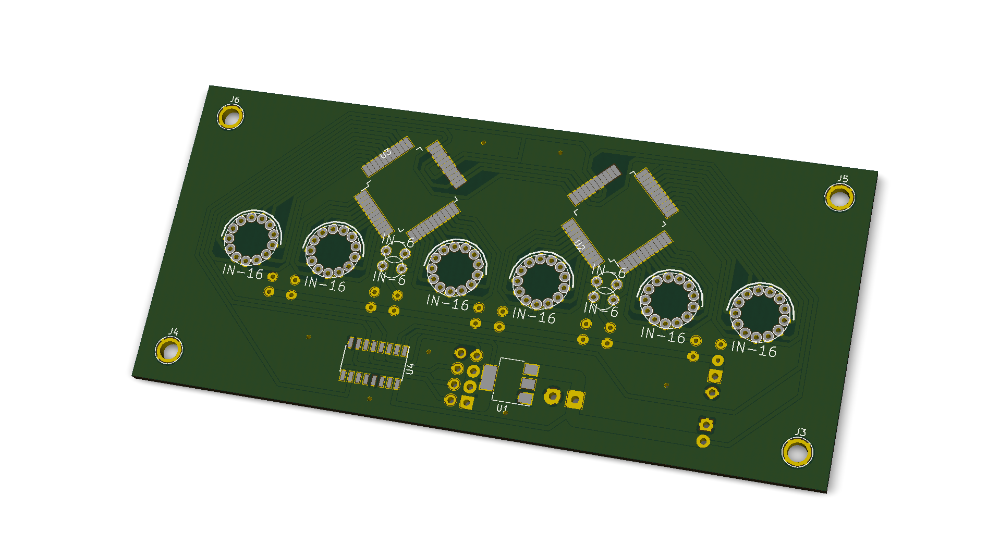

# NixiESP16

Yet another Nixie clock project!

Some highlights:

* HV5530, HV5522 or similar driven IN-16 tubes
* CD4504B for 3.3V to 12V level shifting
* ESP8266 for time synchronization
* LM1117-3.3V for logic power supply
* No step up converter on-board, pin headers for connecting third party power supply
  <a href="http://www.ebay.com/itm/DC-5V-12V-to-170V-DC-High-Voltage-NIXIE-Power-Supply-Module-PSU-NIXIE-TUBE-ERA-/322511957768?hash=item4b1735ef08">third party power supply</a>
* HV5530 symbol created using
  <a href="http://kicad.rohrbacher.net/quicklib.php">Quick KICAD Library Component Builder</a>

Some KiCad screenshots:

